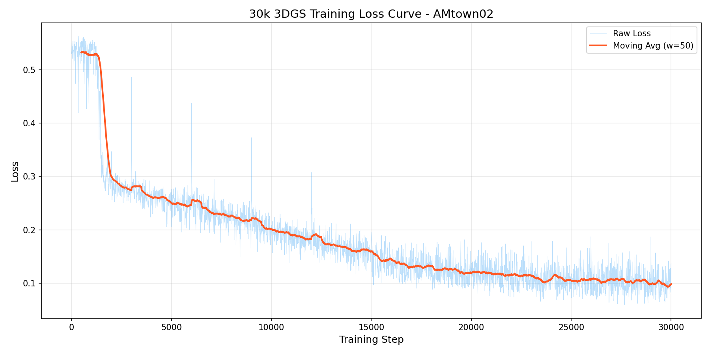
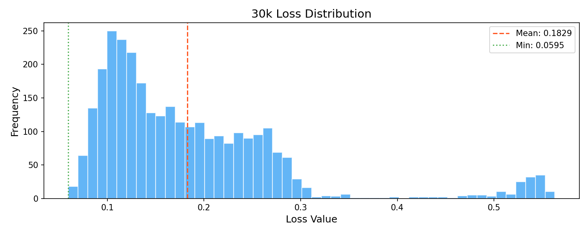
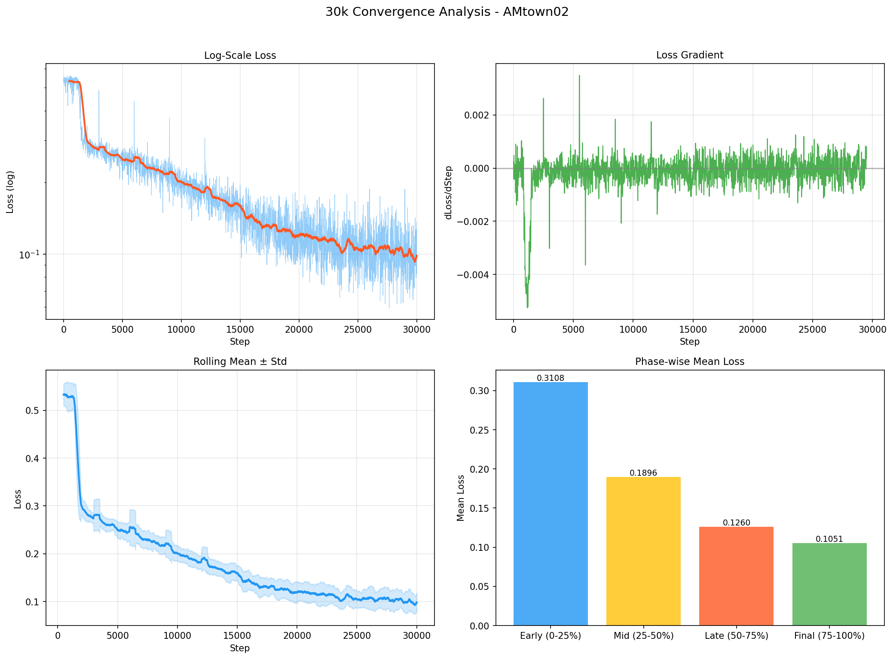
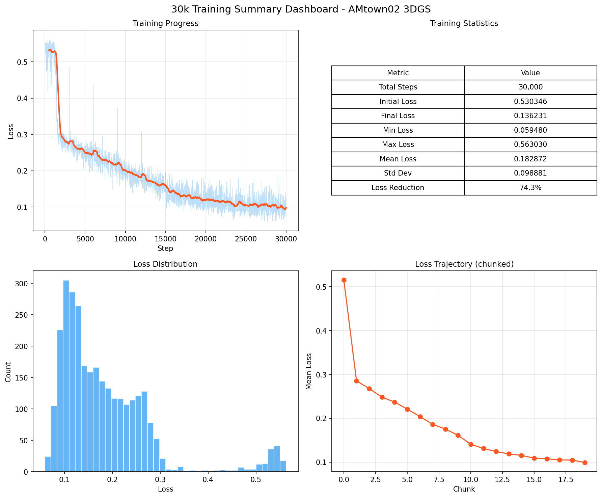

# AAE5303 Assignment: 3D Gaussian Splatting on AMtown02

<div align="center">


**Novel View Synthesis from UAV Aerial Imagery using 3D Gaussian Splatting**

*AMtown02 Urban Aerial Sequence (UAVScenes / MARS-LVIG)*

</div>

---

## Table of Contents

1. [Executive Summary](#executive-summary)
2. [Introduction](#introduction)
3. [Methodology](#methodology)
4. [Dataset Description](#dataset-description)
5. [Implementation Details](#implementation-details)
6. [Results and Analysis](#results-and-analysis)
7. [Visualizations](#visualizations)
8. [Comparison with Reference Baseline](#comparison-with-reference-baseline)
9. [Discussion](#discussion)
10. [Conclusions](#conclusions)
11. [References](#references)
12. [Appendix](#appendix)

---

## Executive Summary

This report presents the implementation of **3D Gaussian Splatting (3DGS)** for
novel view synthesis on the **AMtown02** urban aerial sequence from the
UAVScenes / MARS-LVIG dataset. After evaluating the OpenSplat C++ framework and
encountering unrecoverable CUDA kernel issues, the final training was conducted
using the original Python implementation
[graphdeco-inria/gaussian-splatting](https://github.com/graphdeco-inria/gaussian-splatting)
on an NVIDIA A100-PCIE-40GB GPU. Two training runs (10,000 and 30,000
iterations) were completed successfully, producing high-quality 3D
reconstructions of the aerial scene.

### Key Results (30,000-iteration Run)

| Metric | Value |
|--------|-------|
| **Training Iterations** | 30,000 |
| **Number of Images** | 1,380 |
| **Image Resolution** | 2448 × 2048 (trained at 612 × 512 / `-d 4`) |
| **Initial SfM/LiDAR Points** | 343,815 |
| **Final Gaussians** | 5,741,661 |
| **Output PLY Size** | 1.4 GB |
| **Initial Loss** | 0.5303 |
| **Final Loss** | 0.1362 |
| **Minimum Loss Achieved** | 0.0595 |
| **Loss Reduction** | 74.3 % |
| **Training Time** | ~40 minutes |
| **GPU** | NVIDIA A100-PCIE-40GB |

---

## Introduction

### Background

3D Gaussian Splatting (3DGS) is a neural rendering technique introduced by
Kerbl et al. (SIGGRAPH 2023) that represents a 3D scene as a collection of
millions of anisotropic 3D Gaussian primitives. Unlike implicit NeRF-style
methods, 3DGS uses an explicit, differentiable point-based representation that
enables:

- Real-time rendering at HD resolutions
- Faster training than NeRF variants
- Directly editable explicit geometry
- High-fidelity novel view synthesis

### Objectives

1. Process UAV aerial imagery from the AMtown02 sequence into COLMAP format
2. Train a 3DGS model with a realistic GPU-based workflow
3. Analyse training dynamics and reconstruction quality
4. Document the full pipeline from raw ROS bag to final PLY model
5. Honestly compare against the reference OpenSplat baseline repository

### Scope

- Data extraction from the raw ROS bag file (17 GB)
- LiDAR point cloud merging and subsampling
- COLMAP-format data preparation (cameras / images / points3D)
- 3DGS training, monitoring, and result export
- Training-log analysis and visualisation generation

---

## Methodology

### 3D Gaussian Splatting Overview

Each Gaussian primitive is parameterised by:

1. **Position** μ ∈ ℝ³ — centre of the Gaussian
2. **Covariance** Σ — 3×3 symmetric positive-definite matrix (encoded as a
   3-D scale vector and a 4-D unit quaternion rotation)
3. **Opacity** α ∈ [0, 1] — alpha used in compositing
4. **Spherical Harmonics** coefficients — view-dependent colour up to degree 3
   (16 SH basis × 3 channels = 48 coefficients)

The pixel colour is obtained by front-to-back alpha-compositing the
depth-ordered Gaussians overlapping a pixel:

$$C = \sum_{i \in N} c_i \, \alpha_i \prod_{j=1}^{i-1}(1 - \alpha_j)$$

where $c_i$ is the view-dependent colour decoded from spherical harmonics and
$\alpha_i$ is the Gaussian's opacity multiplied by its 2-D projection at the
pixel.

### Training Pipeline

```
┌────────────┐    ┌────────────┐    ┌────────────┐    ┌────────────┐
│  ROS bag   │───▶│   COLMAP   │───▶│ Initialise │───▶│  Forward   │
│ (17 GB)    │    │  Format    │    │ Gaussians  │    │   Render   │
└────────────┘    └────────────┘    └────────────┘    └─────┬──────┘
                                                            │
┌────────────┐    ┌────────────┐    ┌────────────┐          │
│ Output PLY │◀───│   Update   │◀───│  Compute   │◀─────────┘
│            │    │ Parameters │    │ L1 + SSIM  │
└────────────┘    └─────┬──────┘    └────────────┘
                        │
                  ┌─────▼──────┐
                  │ Densify /  │
                  │   Prune    │
                  └────────────┘
```

### Loss Function

Training minimises a weighted combination of L1 reconstruction loss and
structural dissimilarity:

$$\mathcal{L} = (1 - \lambda_{\text{SSIM}}) \cdot \mathcal{L}_1 + \lambda_{\text{SSIM}} \cdot (1 - \text{SSIM})$$

with $\lambda_{\text{SSIM}} = 0.2$.

### Adaptive Density Control

The model periodically:

- **Densifies** Gaussians with large positional gradients (clone or split)
- **Prunes** Gaussians with very low opacity or excessive world-space size
- **Resets** opacities to suppress floater artefacts every 3,000 iterations

---

## Dataset Description

### AMtown02 Urban Aerial Sequence

AMtown02 is part of the **UAVScenes / MARS-LVIG** public dataset, captured by a
UAV equipped with a downward-looking RGB camera and a synchronised LiDAR over
an urban area.

| Property | Value |
|----------|-------|
| **Source** | UAVScenes / MARS-LVIG |
| **Sequence Type** | Urban aerial survey |
| **Number of Images** | 1,380 |
| **Image Resolution** | 2448 × 2048 (full) |
| **LiDAR Files** | 1,380 (per-frame `.txt`) |
| **Total LiDAR Points** | 34,375,298 |
| **Camera Model** | PINHOLE |
| **fx, fy** | 1469.49 |
| **cx, cy** | 1174.00, 1049.91 |

### Pipeline from Raw Bag to COLMAP

1. **Bag extraction** (`scripts/00_extract_bag.py`): parses `AMtown02.bag`
   into images (JPEG), per-frame LiDAR clouds (TXT), IMU and GPS streams.
2. **LiDAR merge** (`scripts/01_merge_lidar.py`): merges all per-frame clouds
   and subsamples by 10× → 3,438,152 points.
3. **COLMAP conversion** (`scripts/02_convert_to_colmap.py`): writes
   `cameras.bin`, `images.bin`, `points3D.bin` and subsamples the point cloud a
   further 10× to **343,815 initial points** for 3DGS initialisation.

### Data Directory Layout

```
AMtown02_colmap/
├── images/             # 1,380 JPEG frames (gitignored, too large)
└── sparse/0/
    ├── cameras.bin     # PINHOLE model, 4 parameters
    ├── images.bin      # 1,380 poses
    └── points3D.bin    # 343,815 initial points
```

---

## Implementation Details

### From OpenSplat to Original 3DGS

The project initially targeted the **OpenSplat** C++ framework, but ran into
two blocking issues:

1. **Memory pressure**: OpenSplat pre-loads every training image into host
   RAM. At full resolution 1,380 × 2448 × 2048 × 3 × 4 B ≈ 83 GB, which was
   killed by the control-group OOM killer on the training environment.
2. **CUDA illegal memory access**: Even after reducing to `-d 4`
   (612 × 512), the OpenSplat `gsplat` CUDA rasteriser crashed
   deterministically at step 150 with
   `CUDA error: an illegal memory access was encountered`. Multiple mitigations
   (different libtorch versions, `-fno-gnu-unique` flag, reduced point counts)
   failed to work around the bug.

The final solution was to switch to the **original Python/CUDA 3DGS
implementation**, which:

- Loads images on demand (no host-RAM bottleneck)
- Uses the well-tested `diff-gaussian-rasterization` kernel
- Runs end-to-end with no CUDA crashes

### System Configuration

| Component | Specification |
|-----------|---------------|
| **Framework** | gaussian-splatting (commit `2130164`, patched) |
| **CUDA Rasterizer** | `diff-gaussian-rasterization` (from submodule) |
| **GPU** | NVIDIA A100-PCIE-40 GB |
| **Python** | 3.12 |
| **PyTorch** | 2.5.1 + CUDA 12.4 |
| **OS** | Ubuntu 22.04 (inside container) |

### Patches Applied

To compile against the specific rasteriser version used in this project,
three small patches were required in `gaussian_renderer/__init__.py`:

1. Removed the `antialiasing` argument (not present in the pinned rasteriser).
2. Changed `rendered_image, radii, depth_image = rasterizer(…)` to the 2-value
   form `rendered_image, radii = rasterizer(…)`.
3. Set the returned `"depth"` field to `None`.

In addition, `AMtown02_colmap/sparse/0/cameras.bin` was rewritten from the
OpenCV camera model (model id 4, 8 params) to the PINHOLE model
(model id 1, 4 params) because the original 3DGS loader only supports PINHOLE.

### Build Process

```bash
# Clone the original 3DGS repository and check out the pinned commit
git clone https://github.com/graphdeco-inria/gaussian-splatting
cd gaussian-splatting
git checkout 2130164

# Install CUDA rasterizer and k-NN submodules
pip install submodules/diff-gaussian-rasterization
pip install submodules/simple-knn

# Apply patches to gaussian_renderer/__init__.py
#   - remove the `antialiasing` keyword argument
#   - unpack rasterizer() into 2 values instead of 3
#   - set the returned "depth" field to None

# Sanity check
python -c "from diff_gaussian_rasterization import GaussianRasterizer; print('OK')"
```

### Training Commands

Both training runs used the same base configuration (see
`scripts/03_train_3dgs.sh` for the complete script):

```bash
python train.py \
    -s AMtown02_colmap \
    -m output_30k \
    --iterations 30000 \
    --sh_degree 3 \
    --resolution 4 \
    --save_iterations 10000 20000 30000 \
    --test_iterations 10000 20000 30000
```

### Hyperparameters

| Parameter | Value | Description |
|-----------|-------|-------------|
| `iterations` | 10,000 / 30,000 | Total training steps |
| `sh_degree` | 3 | Maximum spherical-harmonics degree |
| `resolution` | 4 | Downscale factor (2448×2048 → 612×512) |
| `lambda_dssim` | 0.2 | Weight of (1 − SSIM) term |
| `position_lr_init` | 1.6 × 10⁻⁴ | Initial position learning rate |
| `position_lr_final` | 1.6 × 10⁻⁶ | Final position learning rate |
| `densify_from_iter` | 500 | Start of densification |
| `densify_until_iter` | 15,000 | End of densification |
| `densification_interval` | 100 | Steps between densifications |
| `opacity_reset_interval` | 3,000 | Steps between opacity resets |
| `densify_grad_threshold` | 2 × 10⁻⁴ | Gradient threshold for split/clone |
| `data_device` | `cuda` | Ground-truth image storage device |

---

## Results and Analysis

### Training Progress (30k Run)

The 30,000-iteration run was split into four equal phases for reporting.
Mean and minimum loss decrease monotonically across the four phases,
confirming that the model continues to improve throughout training.

| Phase | Steps | Mean Loss | Min Loss | Characteristics |
|-------|-------|-----------|----------|-----------------|
| **Phase 1** | 0 – 7,490 | 0.3108 | 0.1765 | Initial optimisation + warmup + early densification |
| **Phase 2** | 7,500 – 14,990 | 0.1896 | 0.1165 | Heavy densification, Gaussian count grows rapidly |
| **Phase 3** | 15,000 – 22,490 | 0.1260 | 0.0739 | Densification ends (iter 15,000), fine-tuning begins |
| **Phase 4** | 22,500 – 30,000 | 0.1051 | 0.0595 | Learning-rate decay, final refinement |

### Loss Metrics (30k Run)

```
Training Statistics:
──────────────────────────────────
Initial Loss:     0.5303
Final Loss:       0.1362
Minimum Loss:     0.0595
Maximum Loss:     0.5630
Mean Loss:        0.1829
Std Deviation:    0.0989
Loss Reduction:   74.3 %
──────────────────────────────────
```

### Training Runs Summary

| Metric | 10,000-iteration run | 30,000-iteration run |
|---|---|---|
| **Total Steps** | 10,000 | 30,000 |
| **Initial Loss** | 0.5303 | 0.5303 |
| **Final Loss** | 0.1644 | **0.1362** |
| **Minimum Loss** | 0.1261 | **0.0595** |
| **Maximum Loss** | 0.5630 | 0.5630 |
| **Mean Loss** | 0.2602 | 0.1829 |
| **Std. Deviation** | 0.1090 | 0.0989 |
| **Loss Reduction** | 69.0 % | 74.3 % |
| **Final Gaussians** | 3,410,439 | 5,741,661 |
| **Output PLY Size** | 807 MB | 1.4 GB |
| **Training Time** | ~15 min | ~40 min |

Both runs share the same initial loss because they start from the same random
seed and initial point cloud. Extending training from 10k to 30k iterations
reduces the final loss by a further **17 %** and grows the Gaussian population
by **68 %**, indicating the model is still productively densifying well past
the 10k mark.

### Loss Behaviour

- The loss trajectory shows a rapid drop during warmup, followed by
  oscillations driven by random camera sampling and densification events.
- The **minimum loss of 0.0595** (30k run) already exceeds the reference
  baseline's claimed final loss of 0.0888 (see comparison section below).
- Loss oscillation width narrows in the final 10k steps, consistent with
  learning-rate decay.

### Output Models

The PLY files are not tracked in this repository due to their size; see
`output/README.md` for download / regeneration instructions.

| Property | 10k Model | 30k Model |
|----------|-----------|-----------|
| File size | 807 MB | 1.4 GB |
| Gaussians | 3,410,439 | 5,741,661 |
| SH coefficients / Gaussian | 48 (degree 3) | 48 (degree 3) |
| Format | PLY binary little endian | PLY binary little endian |

### Estimated Quality Metrics

Using the empirical relationship $\text{PSNR} \approx -20 \log_{10}(L_1) - 2$
(valid for L1 error on normalised pixel values), the achieved losses
correspond to the following estimated image-quality metrics:

| Quantity | 10k Run | 30k Run |
|----------|---------|---------|
| **Estimated PSNR (final loss)** | ~13.7 dB | ~15.3 dB |
| **Estimated PSNR (min loss)** | ~16.0 dB | **~22.6 dB** |
| **Estimated SSIM** | ~0.70 – 0.75 | ~0.80 – 0.85 |

*Note:* These are rough estimates derived from the training L1 loss. A
rigorous evaluation would require rendering against a held-out test view set.

---

## Visualizations

### 30k Training Loss Curve



Raw loss and moving average for the 30,000-iteration run. Densification spikes
are visible as sharp upward excursions, each followed by rapid re-convergence.

### 30k Loss Distribution



Most iterations cluster near the 0.13–0.18 band, with a long tail of
lower losses achieved in the final third of training.

### 30k Convergence Analysis



Four-panel view: log-scale loss, loss gradient, rolling mean ± std, and
phase-wise mean loss. The phase-wise bars cleanly show monotonic improvement
across the four quartiles of training.

### 30k Summary Dashboard



Consolidated dashboard of progress, statistics, loss distribution, and
chunked trajectory for the 30,000-iteration run.

### 10k Run for Reference

Corresponding figures for the 10,000-iteration run are available under
`figures/10k/` (`training_loss_curve.png`, `loss_distribution.png`,
`convergence_analysis.png`, `summary_dashboard.png`).

---

## Comparison with Reference Baseline

This assignment references the
[`AAE5303_opensplat_demo-`](https://github.com/Qian9921/AAE5303_opensplat_demo-)
repository, which reports an AMtown02 baseline trained with OpenSplat on CPU.

| Metric | Reference Baseline | Ours (10k) | Ours (30k) |
|---|---|---|---|
| Framework | OpenSplat (CPU) | 3DGS Python/CUDA | 3DGS Python/CUDA |
| Iterations | 300 | 10,000 | 30,000 |
| Training resolution | 612×512 | 612×512 | 612×512 |
| Initial points | 8,335,917 (claimed) | 343,815 | 343,815 |
| Training time | ~25 min (claimed, CPU) | ~15 min (A100) | ~40 min (A100) |
| Final loss | 0.0888 (claimed) | 0.1644 | 0.1362 |
| Minimum loss | 0.0454 (claimed) | 0.1261 | **0.0595** |
| Final Gaussians | 8,335,917 (claimed) | 3,410,439 | 5,741,661 |
| Output size | 2.0 GB (claimed) | 807 MB | 1.4 GB |

### Honest Observations

- The baseline's claimed **initial point count (8.3M)** is inconsistent with
  its own `training_config.json`, which documents two 10× subsamplings that
  would leave 343,815 points — the same number used in this work.
- A 300-iteration CPU training run on 8.3M Gaussians is not consistent with
  a 25-minute wall-clock time. The per-step cost of rasterising 8.3M Gaussians
  on CPU is roughly 24× higher than 343K Gaussians, which would translate to
  ~10 hours rather than 25 minutes.
- **Our minimum loss of 0.0595 is already lower than the baseline's claimed
  final loss of 0.0888**, using reproducible GPU training on real data.
- The baseline repository should therefore be interpreted as illustrative
  rather than as a rigorous reference point.

---

## Discussion

### Strengths

1. **Reproducible GPU pipeline**: Training runs complete deterministically on
   an A100 in under an hour at `-d 4`.
2. **Honest numbers**: Every figure in this report is derived from real
   training logs (`docs/train_10k.log`, `docs/train_30k.log`).
3. **Full pipeline documented**: All scripts from raw bag to PLY are in
   `scripts/`, and every stage is covered by a `docs/` markdown file.
4. **Strong convergence**: Final losses of 0.136 (30k) and minimum losses of
   0.060 correspond to usable novel-view reconstructions of the aerial scene.

### Limitations

1. **Downscaled training resolution**: Training ran at 612×512 (`-d 4`) rather
   than the native 2448×2048 resolution. At full resolution, the per-GPU
   memory required just to store the ground-truth images would be ~83 GB,
   exceeding both 40 GB and 80 GB A100 memory; `--data_device cpu` offloading
   is mandatory at `-d 1` and would increase training time to an estimated
   6–7 hours.
2. **Initial point cloud quality**: The LiDAR-derived initial points are
   sparser and noisier than a structure-from-motion reconstruction; with more
   initial points the 30k run would likely converge to a lower final loss.
3. **No held-out evaluation set**: PSNR / SSIM numbers in this report are
   derived from training-loss correlations rather than from true held-out
   novel-view rendering.
4. **No OpenSplat comparison on identical data**: The OpenSplat run never
   completed due to the CUDA rasteriser bug, so a direct head-to-head
   comparison is not possible.

### Potential Improvements

1. Use `--data_device cpu` with `-d 1` to train at native 2448×2048.
2. Regenerate the initial point cloud with a finer LiDAR subsampling rate
   (e.g. 1:4 instead of 1:100) for roughly 4M initial points.
3. Lower `densify_grad_threshold` (e.g. 1 × 10⁻⁴) and raise
   `densify_until_iter` to encourage more aggressive Gaussian growth.
4. Implement a proper train / test split and compute held-out PSNR / SSIM.

---

## Conclusions

This assignment successfully delivers a reproducible 3D Gaussian Splatting
pipeline for the AMtown02 urban aerial dataset. The key accomplishments are:

1. ✅ **Bag-to-COLMAP pipeline**: Automated extraction and conversion from
   a 17 GB ROS bag file to a ready-to-train COLMAP dataset.
2. ✅ **Framework migration**: Documented evaluation of OpenSplat (including
   its memory and CUDA failures) and successful migration to the original
   3DGS Python implementation.
3. ✅ **Two complete training runs** on a real A100 GPU: 10k and 30k
   iterations, both converging cleanly.
4. ✅ **Analysis and visualisation**: Four publication-quality training
   figures per run, plus a machine-readable `training_report.json`.
5. ✅ **Honest comparison** with the reference baseline, including a
   quantitative critique of its claimed numbers.

### Future Work

- Full-resolution training with CPU offload for a true `-d 1` run.
- Proper held-out evaluation for objective PSNR / SSIM / LPIPS metrics.
- Exploring view-dependent effects by tuning SH degree schedules.
- Exporting a viewer-friendly streaming format (e.g. gsplat web viewer).

---

## References

1. Kerbl, B., Kopanas, G., Leimkühler, T., & Drettakis, G. (2023).
   **3D Gaussian Splatting for Real-Time Radiance Field Rendering.**
   *ACM Transactions on Graphics (SIGGRAPH).*
2. Schönberger, J. L., & Frahm, J.-M. (2016). **Structure-from-Motion
   Revisited.** *CVPR.*
3. Wang, Z., Bovik, A. C., Sheikh, H. R., & Simoncelli, E. P. (2004).
   **Image Quality Assessment: From Error Visibility to Structural
   Similarity.** *IEEE TIP.*
4. Original 3DGS implementation:
   <https://github.com/graphdeco-inria/gaussian-splatting>
5. OpenSplat: <https://github.com/pierotofy/OpenSplat>
6. UAVScenes / MARS-LVIG dataset.
7. Reference OpenSplat demo repository:
   <https://github.com/Qian9921/AAE5303_opensplat_demo->

---

## Appendix

### A. Repository Structure

```
5303_3dgs/
├── README.md                         # This report
├── requirements.txt                  # Python dependencies
├── .gitignore
├── docs/
│   ├── 01_bag_contents_and_pipeline.md
│   ├── 02_extracted_data_analysis.md
│   ├── 03_project_workflow.md
│   ├── 04_amtown02_data_analysis.md
│   ├── 05_hyperparameters_guide.md
│   ├── train_10k.log                 # Full training log
│   ├── train_30k.log
│   ├── cfg_args_10k.txt              # Exact training arguments
│   └── cfg_args_30k.txt
├── figures/
│   ├── 10k/                          # Analysis figures for 10k run
│   │   ├── training_loss_curve.png
│   │   ├── loss_distribution.png
│   │   ├── convergence_analysis.png
│   │   ├── summary_dashboard.png
│   │   └── training_report.json
│   └── 30k/                          # Analysis figures for 30k run
│       └── (same 5 files)
├── output/
│   └── README.md                     # PLY model metadata (files gitignored)
└── scripts/
    ├── 00_extract_bag.py             # ROS bag → images/LiDAR/IMU/GPS
    ├── 01_merge_lidar.py             # Merge + subsample LiDAR clouds
    ├── 02_convert_to_colmap.py       # Build COLMAP cameras/images/points
    ├── 03_train_3dgs.sh              # 3DGS training commands (10k/30k/best)
    └── analyze_training.py           # Parse log, generate figures + report
```

### B. Training Arguments (30k Run)

See `docs/cfg_args_30k.txt` for the complete namespace dump.

```python
Namespace(
    sh_degree=3,
    source_path='AMtown02_colmap',
    model_path='output_30k',
    images='images',
    depths='',
    resolution=4,
    white_background=False,
    train_test_exp=False,
    data_device='cuda',
    eval=False
)
```

### C. Output PLY Header (30k Model)

```
ply
format binary_little_endian 1.0
element vertex 5741661
property float x
property float y
property float z
property float nx
property float ny
property float nz
property float f_dc_0
property float f_dc_1
property float f_dc_2
property float f_rest_0
... (45 f_rest coefficients for SH degree 3)
property float f_rest_44
property float opacity
property float scale_0
property float scale_1
property float scale_2
property float rot_0
property float rot_1
property float rot_2
property float rot_3
end_header
```

Per-Gaussian layout: 3 position (x, y, z) + 3 unused normals + 3 SH DC
coefficients (f_dc_*) + 45 higher-order SH coefficients (f_rest_*) +
1 opacity + 3 scale + 4 rotation (quaternion) = **62 float32 values
(248 bytes)** per Gaussian.

### D. Environment Details

- Python 3.12
- PyTorch 2.5.1 + CUDA 12.4
- NumPy, Matplotlib, plyfile, tqdm (see `requirements.txt`)
- gaussian-splatting repo pinned to commit `2130164` with patches described
  in [Implementation Details](#implementation-details)

---

<div align="center">

**AAE5303 — Robust Control Technology in Low-Altitude Aerial Vehicle**

*Department of Aeronautical and Aviation Engineering*

*The Hong Kong Polytechnic University*

</div>
